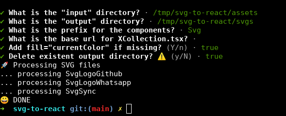

# Tool to convert SVG files to React components

This tool converts SVG files into React TypeScript components.

Capabilities:

1. The tool uses SVGO to optimize the SVG, a lot.
2. The tool uses SVGSON to fix fill="currentColor" (optionally)
3. We wrap the svg into a CSS flex composition to make it easy to adjust the size of the SVG.
4. The resulting code makes it easy to rescale and center the SVG file.
5. The tool also generates an `XCollection.tsx` component to visualize all generated SVG.

**NOTE**: The input files must be named with words separated by dashes `-` or underscores `_`.

## Installation

```bash
npm install -g @cpmech/svg-to-react
```

## Usage

```bash
$ svg-to-react
```



## Examples of output

### SvgSync.tsx

```typescript
export interface SvgSyncProps {
  size?: string; // size of square container
  style?: React.CSSProperties; // not for height or width
}

export const SvgSync: React.FC<SvgSyncProps> = ({ size = '24px', style }) => {
  return (
    <div
      style={{
        display: 'inline-flex',
        alignItems: 'center',
        justifyContent: 'center',
        ...style,
        height: size,
        width: size,
      }}
    >
      <div
        style={{
          position: 'relative',
          height: 0,
          width: '100%',
          padding: 0,
          paddingBottom: '100%',
        }}
      >
        <svg
          style={{
            position: 'absolute',
            height: '100%',
            width: '100%',
            left: 0,
            top: 0,
          }}
          viewBox="0 0 512 512"
          xmlns="http://www.w3.org/2000/svg"
        >
          <path d="M434.67 285.59v-29.8c0-98.73-80.24-178.79-179.2-178.79a179 179 0 00-140.14 67.36m-38.53 82v29.8C76.8 355 157 435 256 435a180.45 180.45 0 00140-66.92" fill="none" stroke="currentColor" strokeLinecap="round" strokeLinejoin="round" strokeWidth="32"/><path fill="none" stroke="currentColor" strokeLinecap="round" strokeLinejoin="round" strokeWidth="32" d="M32 256l44-44 46 44m358 0l-44 44-46-44"/>
        </svg>
      </div>
    </div>
  );
};
```

### XCollection.tsx

```typescript
import { IconLogoGithub } from './assets/IconLogoGithub';
import { IconSync } from './assets/IconSync';

const size = '64px';
const color = '#3184d1';

const icons = [
  { name: 'IconLogoGithub', icon: <IconLogoGithub size={size} /> },
  { name: 'IconSync', icon: <IconSync size={size} /> },
];

export const XCollection: React.FC = () => {
  return (
    <div
      style={{
        marginTop: 50,
        marginBottom: 50,
        width: '100%',
        display: 'flex',
        flexWrap: 'wrap',
        gap: '8px',
      }}
    >
      {icons.map(({ name, icon }, i) => (
        <a
          key={i}
          href={`https://github.com/cpmech/iricons/blob/main/src/svgs/assets/${name}.tsx`}
          style={{ color }}
        >
          <div
            style={{
              display: 'flex',
              flexDirection: 'column',
              justifyContent: 'center',
              alignContent: 'center',
            }}
          >
            <div
              style={{
                display: 'flex',
                flexDirection: 'row',
                justifyContent: 'center',
                color,
              }}
            >
              {icon}
            </div>
            <div
              style={{
                display: 'flex',
                flexDirection: 'row',
                justifyContent: 'center',
                fontSize: '0.7em',
              }}
            >
              {name}
            </div>
          </div>
        </a>
      ))}
    </div>
  );
};
```

## References

This project is inspired by the article entitled "[Making SVG icon libraries](http://nicolasgallagher.com/making-svg-icon-libraries-for-react-apps)."
